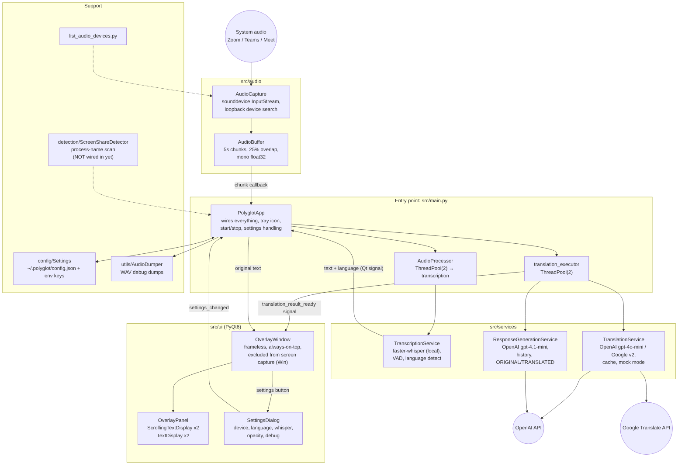
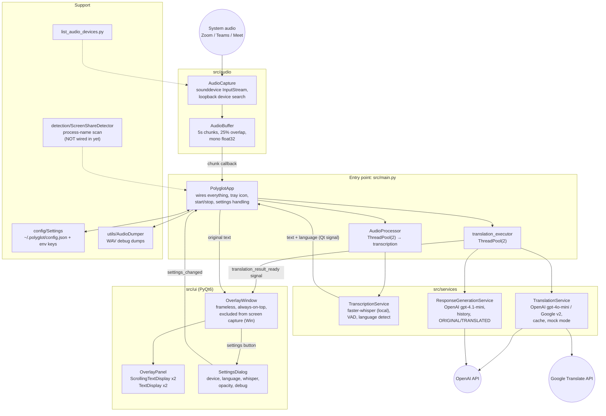

# Architecture (v0 prototype)

```mermaid
flowchart TB
  subgraph ENTRY["Entry point: src/main.py"]
    APP["PolyglotApp<br/>wires everything, tray icon,<br/>start/stop, settings handling"]
    AP["AudioProcessor<br/>ThreadPool(2) → transcription"]
    TEX["translation_executor<br/>ThreadPool(2)"]
  end

  subgraph AUDIO["src/audio"]
    CAP["AudioCapture<br/>sounddevice InputStream,<br/>loopback device search"]
    BUF["AudioBuffer<br/>5s chunks, 25% overlap,<br/>mono float32"]
  end

  subgraph SVC["src/services"]
    TR["TranscriptionService<br/>faster-whisper (local),<br/>VAD, language detect"]
    TL["TranslationService<br/>OpenAI gpt-4o-mini / Google v2,<br/>cache, mock mode"]
    RS["ResponseGenerationService<br/>OpenAI gpt-4.1-mini,<br/>history, ORIGINAL/TRANSLATED"]
  end

  subgraph UI["src/ui (PyQt6)"]
    OW["OverlayWindow<br/>frameless, always-on-top,<br/>excluded from screen capture (Win)"]
    PN["OverlayPanel<br/>ScrollingTextDisplay x2<br/>TextDisplay x2"]
    SD["SettingsDialog<br/>device, language, whisper,<br/>opacity, debug"]
  end

  subgraph SUP["Support"]
    ST["config/Settings<br/>~/.polyglot/config.json + env keys"]
    SS["detection/ScreenShareDetector<br/>process-name scan<br/>(NOT wired in yet)"]
    DU["utils/AudioDumper<br/>WAV debug dumps"]
    LD["list_audio_devices.py"]
  end

  EXT1(("System audio<br/>Zoom / Teams / Meet"))
  EXT2(("OpenAI API"))
  EXT3(("Google Translate API"))

  EXT1 --> CAP --> BUF -->|chunk callback| APP
  APP --> DU
  APP --> AP --> TR
  TR -->|"text + language (Qt signal)"| APP
  APP --> TEX --> TL
  TEX --> RS
  TL --> EXT2
  TL --> EXT3
  RS --> EXT2
  TEX -->|translation_result_ready signal| OW
  APP -->|original text| OW
  OW --> PN
  OW -->|settings button| SD
  SD -->|settings_changed| APP
  APP <--> ST
  SS -.-> APP
  LD -.-> CAP
```
